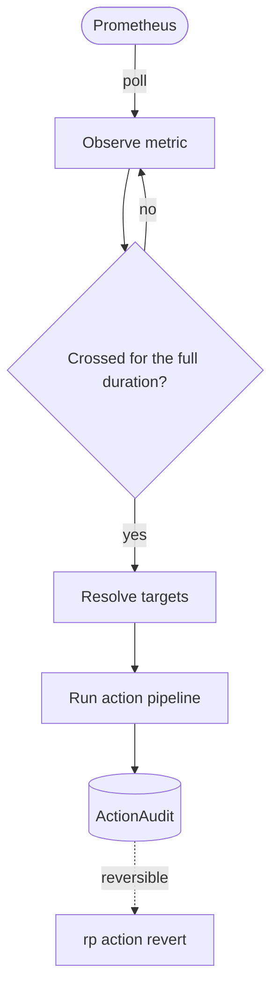

<div align="center">


# reactive-policy

**Turn sustained Prometheus metric conditions into deterministic, auditable,
reversible Kubernetes & GitOps actions.**

[](https://github.com/Vedooo/reactive-policy/actions)
[](https://github.com/Vedooo/reactive-policy/releases)
[](https://artifacthub.io/packages/search?repo=reactive-policy)
[](LICENSE)
[](https://pkg.go.dev/github.com/Vedooo/reactive-policy)

[Documentation](https://vedooo.github.io/reactive-policy) ·
[Installation](https://vedooo.github.io/reactive-policy/installation/) ·
[Quickstart](https://vedooo.github.io/reactive-policy/quickstart/) ·
[ArtifactHub](https://artifacthub.io/packages/search?repo=reactive-policy) ·
[Changelog](CHANGELOG.md)

</div>

---

`reactive-policy` is the missing piece between **"something is wrong"** (an
alert) and **"something was done about it"** (an action) — with cooldown, rate
limiting, reversibility, and a full audit trail. Declarative and deterministic today — with AI-driven, agent-assisted automation on the roadmap.

## How it works



The operator polls a metric, waits until the condition is **sustained** (not a
one-off spike), resolves the policy's target selector into concrete cluster
resources, and runs an ordered pipeline of pluggable actions against each —
recording everything and respecting cooldown, an hourly rate limit, and
reversibility.

## Why

Alerts page humans. Humans open runbooks and do the same things over and over:
suspend a bad deploy, annotate the incident, notify the channel. That is
**toil** — slow, error-prone, and invisible (no record of who did what, when, or
why). `reactive-policy` encodes that runbook as a declarative policy and runs it
automatically, **safely**, and **auditably**. Alertmanager tells you something is
wrong; reactive-policy *does something about it* — and lets you undo it.

## Example — bad-deploy auto-containment

```yaml
apiVersion: reactive-policy.io/v1alpha1
kind: ReactivePolicy
metadata:
  name: api-error-rate-guard
spec:
  target:
    selector: { matchLabels: { app: api-service } }
    kinds:
      - { apiVersion: argoproj.io/v1alpha1, kind: Application }
      - { apiVersion: apps/v1, kind: Deployment }
    maxResources: 5
  observe:
    source: prometheus
    endpoint: http://prometheus.monitoring:9090
    query: |
      sum(rate(http_requests_total{app="api-service",status=~"5.."}[2m]))
      / sum(rate(http_requests_total{app="api-service"}[2m]))
    threshold: "0.05"
    operator: GreaterThan
    duration: 2m
  actions:
    - plugin: argocd.suspend           # stop GitOps from re-syncing the bad release
    - plugin: k8s.annotate             # mark the incident on the affected resources
      params: { key: "reactive-policy.io/incident", value: "5xx {{ .MetricValue }} at {{ .Timestamp }}" }
    - plugin: notify.slack
      params: { webhookSecretRef: { name: slack-webhook, key: url }, channel: "#sre-alerts" }
  cooldown: 10m
  maxTriggersPerHour: 3
```

When the 5xx rate stays above 5% for two minutes, the operator suspends the
ArgoCD app's auto-sync, annotates the matched resources, and posts to Slack —
before anyone wakes up. Every run is an `ActionAudit`; the suspend is reversed
with a single `rp action revert`.

## Quick start

Install the operator with Helm (OCI chart):

```bash
helm install reactive-policy \
  oci://ghcr.io/vedooo/charts/reactive-policy \
  --namespace reactive-policy --create-namespace
```

Apply a policy, then watch it work with the `rp` CLI:

```bash
kubectl apply -f https://raw.githubusercontent.com/Vedooo/reactive-policy/main/config/samples/api_error_rate_guard.yaml

rp policy list -A          # status table across namespaces
rp action audit -n demo    # recent triggers and their outcomes
```

> **New here?** The [Quickstart guide](https://vedooo.github.io/reactive-policy/quickstart/)
> walks a fresh `kind` cluster from zero to a policy that visibly annotates a
> Deployment — including a tiny mock metric source — in about five minutes.

## Concepts

Every trigger passes through the same gates, in order:

| Gate / mechanism | What it guarantees |
|---|---|
| **Sustained duration** | A momentary spike never triggers — the condition must hold for the configured `duration`. |
| **Cooldown** | A minimum quiet period between triggers, so a flapping metric can't thrash. |
| **Hourly rate limit** | `maxTriggersPerHour` caps runaway behavior — counted from persisted `ActionAudit` records, so it **survives operator restarts**. |
| **Target cap** | `maxResources` refuses to act if the selector matches more resources than expected — no accidental fan-out. |
| **Reversibility** | Irreversible actions require an explicit `allowIrreversible: true`; reversible ones undo with `rp action revert`. |
| **Audit trail** | One queryable `ActionAudit` per trigger: when, which metric value, which targets, which outcomes. |

## The `rp` CLI

`rp` is a thin, stateless client — every view reads straight from the Kubernetes
API. It links the same plugin registry as the operator, so `plugin list` and
`policy dry-run` validate against the real plugins.

```bash
rp policy list -A               # status table (table | json | yaml)
rp policy describe <name>       # full configuration, status, and conditions
rp policy dry-run policy.yaml   # simulate against live metrics, mutate nothing
rp action audit                 # recent triggers and outcomes
rp action history <policy>      # per-action history for one policy
rp action revert <audit-name>   # ask the operator to reverse a recorded run
rp plugin list                  # installed plugins and their permissions
```

## Plugins

Three built-in plugins ship in v0.x; each implements one `Action` interface and
registers itself, so adding one never touches the core:

- **`notify.slack`** — send a formatted notification via a Slack webhook.
- **`k8s.annotate`** — add or update an annotation on the matched resources.
- **`argocd.suspend`** — pause an ArgoCD Application's auto-sync.

Write your own: see the [Plugin guide](docs/PLUGIN_INTERFACE.md).

## Observability

The operator exposes its own Prometheus metrics and ships ready-to-use assets in
[`observability/`](observability/):

- `grafana-dashboard.json` — an 8-panel dashboard (evaluations, actions, latency,
  triggers, rate limiting, errors).
- `prometheus-rules.yaml` — example alerts, validated with `promtool check rules`;
  deploy them via `--set prometheusRule.enabled=true`.

## Why not…

| Tool | What it does | What's missing |
|------|--------------|----------------|
| **Alertmanager + webhooks** | Routes alerts to external systems | Stateless. No audit history, no multi-action pipelines, no reverse. |
| **KEDA** | Scales workloads based on metrics | Only scaling — no GitOps actions, notifications, or rollback. |
| **Argo Rollouts** | Metric-aware canary deployments | Active only during a rollout, not for steady-state runtime. |
| **Kyverno** | Admission-time policy enforcement | Reacts at admission, never to runtime metrics. |
| **Crossplane** | Declarative cloud provisioning | Not reactive; pull-based reconciliation of desired state. |

## Installation

Helm (OCI) is the supported path:

```bash
helm install reactive-policy oci://ghcr.io/vedooo/charts/reactive-policy \
  --namespace reactive-policy --create-namespace \
  --set serviceMonitor.enabled=true \   # scrape metrics with the Prometheus Operator
  --set prometheusRule.enabled=true     # ship the example alerts
```

Every value is documented in
[`charts/reactive-policy/values.yaml`](charts/reactive-policy/values.yaml). The
full installation guide — prerequisites, RBAC notes, the optional validating
webhook, and uninstall — lives in the
[Installation docs](https://vedooo.github.io/reactive-policy/installation/).

## Documentation

Full docs site: **<https://vedooo.github.io/reactive-policy>**

- [Architecture](docs/ARCHITECTURE.md) · [CRD specification](docs/CRD_SPEC.md) ·
  [Plugin interface](docs/PLUGIN_INTERFACE.md) ·
  [Design decisions](docs/DECISIONS.md) · [Roadmap](docs/ROADMAP.md)
- [Changelog](CHANGELOG.md) · [Contributing](CONTRIBUTING.md) ·
  [Security policy](SECURITY.md)

## Design principles

1. **Deterministic today, AI-assisted tomorrow.** A fully deterministic decision path now; AI-driven, agent-assisted automation is a planned, opt-in layer.
2. **Tool-agnostic core, opinionated plugins.**
3. **Reversibility first.**
4. **Self-observable.**
5. **Rate-limited and audited by default.**

## Project status

reactive-policy is in **beta** (`v0.x`) and actively developed — more plugins
and features are on the way. The CRD API may still change before the stable
**`v1.0`**, which is when it graduates from beta; breaking changes are called
out in the [Changelog](CHANGELOG.md). The safety rails — cooldown, rate limit,
reversibility, audit — are first-class, not afterthoughts.

## License

Apache License 2.0 — see [LICENSE](LICENSE).

## Author

Built by [Vedat Koçoğlu](https://github.com/Vedooo) — Senior SRE at EPAM Systems,
Golden Kubestronaut.
