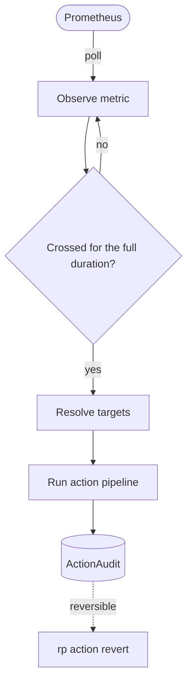

# reactive-policy

**Turn sustained Prometheus metric conditions into deterministic, auditable,
reversible Kubernetes & GitOps actions.** Declarative and deterministic today — with AI-driven, agent-assisted automation on the roadmap.

`reactive-policy` is the missing piece between **"something is wrong"** (an
alert) and **"something was done about it"** (an action) — with cooldown, rate
limiting, reversibility, and a full audit trail.

## Where to go next

- :material-rocket-launch: **[Quickstart](quickstart.md)** — zero to a policy that
  visibly annotates a Deployment on a local `kind` cluster, in ~5 minutes.
- :material-download: **[Installation](installation.md)** — install with Helm,
  configure metrics scraping, enable the optional webhook.
- :material-lightbulb-on: **[Concepts](concepts.md)** — the reconcile loop and the
  safety rails (sustained duration, cooldown, rate limit, reversibility, audit).
- :material-console: **[CLI reference](cli.md)** — inspect and revert with `rp`.

## Why it exists

Alerts page humans. Humans open runbooks and do the same things over and over:
suspend a bad deploy, annotate the incident, notify the channel. That's **toil**
— slow, error-prone, and invisible. reactive-policy encodes that runbook as a
declarative `ReactivePolicy` and runs it automatically, **safely**, and
**auditably**. Alertmanager tells you something is wrong; reactive-policy *does
something about it* — and lets you undo it.

!!! note "Project status"
    reactive-policy is in **beta** (`v0.x`) and actively developed — more plugins
    and features are on the way. The CRD API may still change before the stable
    `v1.0` (when it graduates from beta); breaking changes are recorded in the
    [changelog](https://github.com/Vedooo/reactive-policy/blob/main/CHANGELOG.md).
